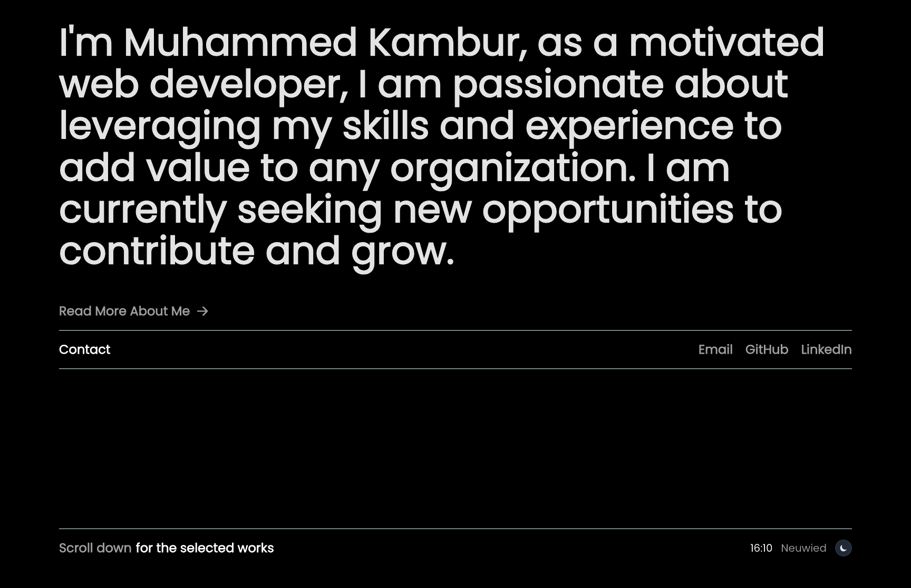

My design portfolio to showcase a few projects. Built with [Astro](https://astro.build/), [TailwindCSS](https://tailwindcss.com/), [MDX](https://mdxjs.com/) and TypeScript. View the [live site](https://mkambur.com/). Check out the [Figma design](https://www.figma.com/design/VBuWfDQj9QlOKpjCETTf7O/Portfolio-Website---Mkambur.com).

This portfolio was initially bootstrapped with [Dante Astro Theme](https://github.com/JustGoodUI/dante-astro-theme) and then completely customized with a new design while maintaining Astro's core functionality.

## Install & run

Make sure you have nodejs 19.9.0 or higher and npm 9.6.3 or higher installed. Install dependencies with:

```bash
npm install
npm run dev
```

## Adding New Projects

1. Create a new `.md` file in `src/content/projects/`
2. Include required frontmatter:

```markdown
---
title: 'Project Name'
description: Project description
publishDate: 'YYYY-MM-DD'
seo:
  image:
    src: '/img/project/thumbnail.avif'
    alt: Project preview
---
```

3. Add project content using Markdown/MDX
4. Place project images in `public/img/[project-name]/`

## Permissions

I'm cool with anyone using the code or parts of the code for their own site, it is open source so people can learn from it and adapt it. However, I would encourage you to modify the theme and components it to make it your own. If you are using the site's design largely unmodified, I'd appreciate being credited as the designer of the website.

I do not give permission to present any of my projects as your own (this is being actively used as my portfolio site and these are my real projects I've worked on).

## TODO

- [ ] Add bookmarks page to share useful resources and links
- [ ] Implement German language support (internationalization)
- [ ] Improve SEO configurations: